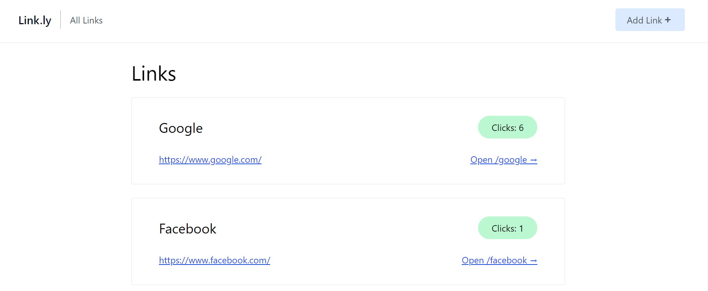
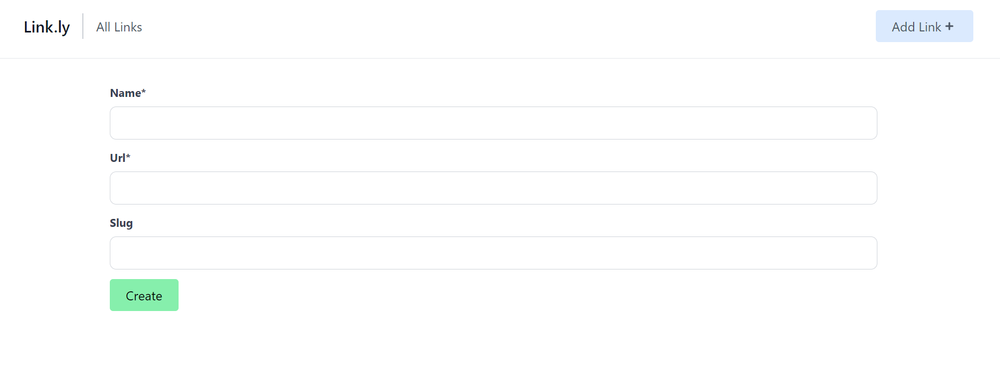

# Linkly: Bitly Clone

Linkly is a Python-based Django project with a sleek interface built using Tailwind CSS, providing a Bitly clone for efficient link shortening.

## Overview

Linkly streamlines the process of link shortening, offering a user-friendly experience with a modern and responsive design. Built on the Django framework and styled with Tailwind CSS, it ensures both robust functionality and an aesthetically pleasing interface.

## Features

- **Effortless Link Shortening:** Simplify long URLs with just a click, creating concise and shareable links.
- **Customization Options:** Tailor your short links with customizable settings to enhance user engagement.
- **Analytics Dashboard:** Track link performance with a built-in analytics dashboard, offering insights into clicks, geographical data, and more.

## Frontend Preview


Explore Linkly's intuitive frontend, where users can seamlessly shorten URLs and manage their links.

## Adding Links


Easily add and customize links through the user-friendly interface, ensuring a hassle-free experience for users.

## Get Started

1. **Clone the Repository:**
   ```bash
   git clone https://github.com/Muhammad-Rebaal/linkly.git
